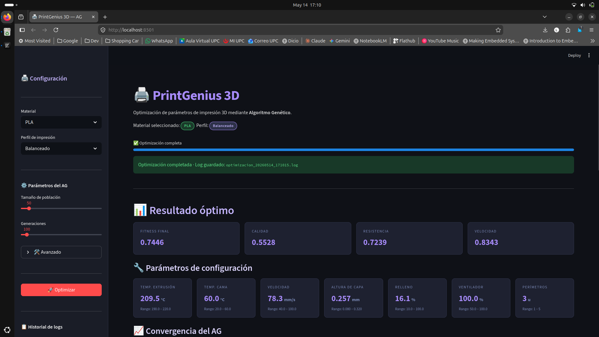
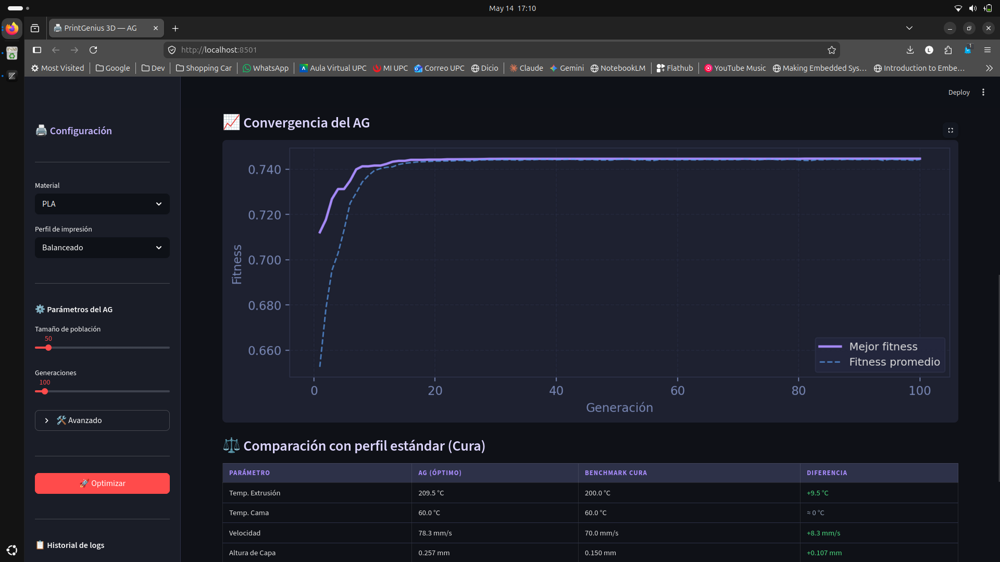
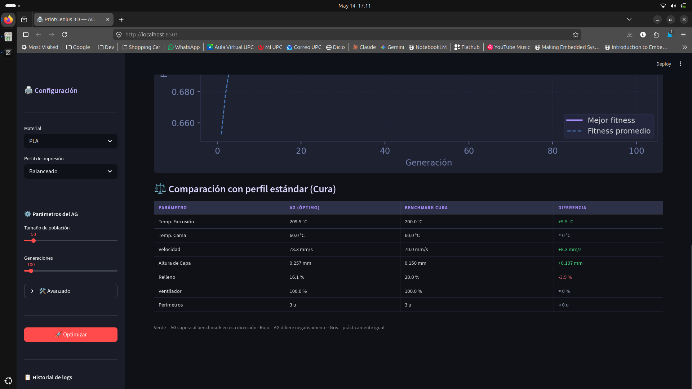
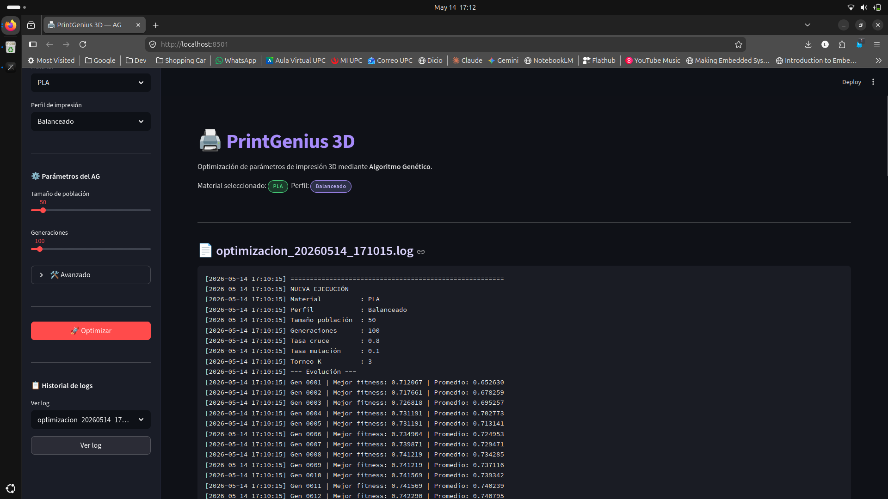
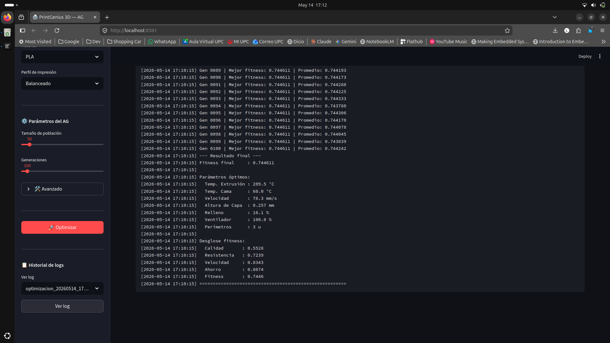

INFORME DE LA APLICACIÓN

INTELIGENCIA ARTIFICIAL (SI404)

TRABAJO 01

**Nombre de la aplicación:**  
PrintGenius 3D \~ Optimizador de Parámetros de Impresión

**Presentado por:**  
Almeida Aguilar, Ivan Antonio

2026

[**1\. Planteamiento del problema a resolver**](#1.-planteamiento-del-problema-a-resolver)

[**2\. Fundamentación del algoritmo de Inteligencia Artificial**](#2.-fundamentación-del-algoritmo-de-inteligencia-artificial)

[**3\. Explicación de la heurística**](#3.-explicación-de-la-heurística)

[**4\. Detalles del código fuente**](#4.-detalles-del-código-fuente)

[Estructura de archivos](#estructura-de-archivos)

[Librerías y frameworks utilizados](#librerías-y-frameworks-utilizados)

[Instalación y ejecución](#instalación-y-ejecución)

[**5\. Pruebas de uso y funcionalidades**](#5.-pruebas-de-uso-y-funcionalidades)

[**6\. Referencias bibliográficas**](#6.-referencias-bibliográficas)

[**7\. Anexos**](#7.-anexos)

[Anexo A: Repositorio del Proyecto](#anexo-a:-repositorio-del-proyecto)

## 

## 1\. Planteamiento del problema a resolver {#1.-planteamiento-del-problema-a-resolver}

La impresión 3D FFF (Fused Filament Fabrication) requiere configurar manualmente un conjunto de parámetros interdependientes, temperatura de extrusión, temperatura de cama, velocidad, altura de capa, porcentaje de relleno, velocidad de ventilador y número de perímetros, que determinan directamente la calidad, resistencia y eficiencia de cada pieza impresa. Encontrar la combinación óptima es un problema de optimización combinatoria de alta dimensionalidad: el espacio de búsqueda es continuo, los parámetros tienen rangos que varían según el material (PLA, ABS, PETG), y los objetivos son conflictivos (por ejemplo, aumentar la velocidad deteriora la calidad).

Actualmente, los usuarios dependen de perfiles predeterminados de softwares como Ultimaker Cura, que ofrecen configuraciones genéricas (Draft, Standard, Fine) sin adaptación al objetivo concreto del usuario. Un usuario que desea una pieza estética no tiene las mismas necesidades que uno que requiere máxima resistencia mecánica.

**PrintGenius 3D** resuelve este problema mediante un Algoritmo Genético que, dados el material elegido y el perfil de uso deseado (Estético, Funcional, Rápido, Balanceado o un perfil completamente personalizado), evoluciona una población de configuraciones candidatas durante varias generaciones hasta converger en una solución óptima personalizada. El sistema presenta los resultados en una interfaz gráfica interactiva (Streamlit), mostrando los parámetros sugeridos, el desglose de fitness por componente, la curva de convergencia del AG y un historial de ejecuciones previas mediante el sistema de logging.

## 2\. Fundamentación del algoritmo de Inteligencia Artificial {#2.-fundamentación-del-algoritmo-de-inteligencia-artificial}

Se aplica un **Algoritmo Genético (AG)** multi-objetivo con función de fitness ponderada. El problema se modela como sigue:

**Entrada:**

* Material de impresión: PLA, ABS o PETG (define los rangos físicos válidos de cada parámetro).  
* Perfil de optimización: Estético, Funcional, Rápido, Balanceado o Personalizado (en este último caso el usuario define directamente los pesos de cada componente y el relleno máximo permitido desde la interfaz).  
* Hiperparámetros del AG: tamaño de población, número de generaciones, tasas de cruce y mutación, tamaño del torneo (configurables en modo avanzado).

**Proceso (ciclo evolutivo):**  

Cada individuo es un vector de 7 genes continuos (los parámetros de impresión). En cada generación:

1. Se evalúa el fitness de toda la población.  
2. Se seleccionan padres mediante torneo de tamaño k.  
3. Se aplica cruce en un punto para generar hijos.  
4. Se introduce mutación gaussiana sobre cada gen con probabilidad `tasa_mutacion`.  
5. Se aplica elitismo: el mejor individuo pasa directamente a la siguiente generación.

**Salida:**

* Configuración óptima de los 7 parámetros de impresión para el material y perfil seleccionados.  
* Desglose del fitness por componente (Calidad, Resistencia, Velocidad, Ahorro).  
* Historial de convergencia (fitness máximo y promedio por generación).

## 3\. Explicación de la heurística {#3.-explicación-de-la-heurística}

La función de fitness implementa una **heurística multi-objetivo basada en conocimiento del dominio**. En lugar de optimizar un único valor numérico, se definen cuatro componentes:

* **Calidad:** Premia capas delgadas (`altura_capa` baja), velocidades lentas, buena adhesión a la cama (temperatura de cama alta), enfriamiento adecuado al material y temperatura de extrusión en el rango bajo-medio para minimizar el stringing.  
    
* **Resistencia Mecánica:** Premia alto porcentaje de relleno y más perímetros, con rendimientos decrecientes (exponente 0.25) para evitar que el algoritmo empuje siempre al máximo. La temperatura de extrusión se orienta al rango medio-alto para mejorar la fusión entre capas.  
    
* **Velocidad de Impresión:** Premia mayor velocidad y mayor altura de capa (capas más gruesas \= menos capas totales). También usa rendimientos decrecientes (exponente 0.5) para generar un equilibrio natural con la penalización de calidad.  
    
* **Ahorro de Material:** Es el inverso de la resistencia: premia bajo relleno y pocos perímetros.

Cada componente se normaliza al intervalo \[0, 1\] para que sean comparables entre sí. El fitness final es una **suma ponderada** según el perfil:

Fitness \= wcalidad · C \+ wresistencia · R \+ wvelocidad · V \+ wahorro · A

Donde los pesos `w` cambian según el perfil (por ejemplo, "Funcional" asigna 0.50 a resistencia y solo 0.10 a velocidad). El ventilador recibe un tratamiento especial: para PLA se maximiza, para ABS se minimiza (para evitar warping por corrientes de aire), y para PETG se centra en el valor medio del rango permitido. Esta heurística refleja el conocimiento experto de impresión 3D y guía al algoritmo hacia soluciones físicamente válidas y útiles para cada caso de uso.

## 4\. Detalles del código fuente {#4.-detalles-del-código-fuente}

### Estructura de archivos {#estructura-de-archivos}

| Archivo | Descripción |
| :---- | :---- |
| `config.py` | Rangos válidos por material, pesos por perfil, límites de relleno y parámetros por defecto del AG |
| `fitness.py` | Función de fitness multi-objetivo: normalización, cálculo de los 4 componentes y suma ponderada |
| `genetic.py` | Implementación completa del AG: inicialización, torneo, cruce en un punto, mutación gaussiana, elitismo |
| `logger.py` | Sistema de logging por ejecución: genera un archivo `.log` con timestamp por cada corrida del AG, registrando configuración inicial, evolución generación a generación y resultado final con desglose de fitness |
| `/logs` | Carpeta autogenerada donde se almacenan todos los archivos `.log` de ejecuciones anteriores |
| `main.py` (GUI) | Interfaz Streamlit: controles interactivos, llamada al AG, visualización de resultados y gráfica de convergencia |

### Librerías y frameworks utilizados {#librerías-y-frameworks-utilizados}

* **Python 3.10+** — Lenguaje principal.  
* **Streamlit** — Framework para la interfaz gráfica web interactiva. Permite construir dashboards con controles (sliders, selectboxes, botones) sin JavaScript.  
* **Matplotlib** — Generación de la gráfica de convergencia del fitness a lo largo de las generaciones.  
* **random** (stdlib) — Generación de números aleatorios para inicialización, torneo, cruce y mutación gaussiana.  
* **os / datetime** (stdlib) — Usados en `logger.py` para gestionar rutas de archivos y generar nombres de log con timestamp (`optimizacion_YYYYMMDD_HHMMSS.log`).

### Instalación y ejecución {#instalación-y-ejecución}

`# Para Linux`  
`chmod +x setup.sh`  
`./setup.sh`  
`# Para Windows`  
`.\setup.ps1`

No se requiere dataset externo. Los rangos válidos y los perfiles de benchmark están definidos directamente en `config.py`, basados en el perfil estándar de Ultimaker Cura (Standard: 0.15 mm) y en las recomendaciones técnicas de los fabricantes de filamento para PLA, ABS y PETG.

## 5\. Pruebas de uso y funcionalidades {#5.-pruebas-de-uso-y-funcionalidades}

**Funcionalidades principales:**

* **Panel de configuración:** El usuario selecciona el material (PLA / ABS / PETG) y el perfil de optimización (Balanceado, Estético, Funcional, Rápido o Personalizado) desde el sidebar. Los parámetros principales del AG, tamaño de población y número de generaciones, se configuran mediante sliders siempre visibles.  
* **Perfil Personalizado:** Cuando el usuario selecciona el perfil "Personalizado", aparece un sub-panel adicional en el sidebar que permite definir el relleno máximo permitido (10–100%) y los cuatro pesos de la función de fitness (Calidad, Resistencia, Velocidad, Ahorro) mediante sliders independientes. Los pesos se normalizan automáticamente para sumar 1.0, de modo que el usuario puede ingresar valores relativos sin preocuparse por el balance matemático.  
* **Modo Avanzado:** Dentro de un `expander` colapsable ("Avanzado"), el usuario puede ajustar los hiperparámetros finos del AG: tasa de cruce, tasa de mutación y tamaño K del torneo de selección. Esto permite experimentar con el comportamiento del algoritmo sin exponer complejidad innecesaria al usuario casual.  
* **Ejecución del AG con progreso en tiempo real:** Al presionar "Optimizar", el algoritmo ejecuta las generaciones y actualiza una barra de progreso con el número de generación actual y el mejor fitness encontrado hasta ese momento, mediante el mecanismo de `callback_generacion`.  
* **Resultados óptimos:** Se presentan cuatro métricas clave (Fitness, Calidad, Resistencia, Velocidad) como tarjetas visuales, seguidas de los 7 parámetros de configuración óptimos con sus rangos de referencia.  
* **Gráfica de convergencia:** Curva del fitness máximo y promedio generación a generación, que permite visualizar la velocidad de convergencia del algoritmo y detectar estancamiento prematuro.  
* **Benchmark comparativo:** Tabla que muestra side-by-side la configuración óptima del AG versus el perfil estándar de Cura para el material seleccionado, con indicadores de color por parámetro (verde: AG supera el benchmark, rojo: difiere negativamente, gris: prácticamente igual).  
* **Sistema de logging:** Cada ejecución del AG genera automáticamente un archivo `.log` en la carpeta `logs/` con nombre `optimizacion_YYYYMMDD_HHMMSS.log`. El log registra la configuración de entrada, el fitness de cada generación y el resultado final con los parámetros óptimos y desglose de fitness. Desde el sidebar, el usuario puede seleccionar cualquier log anterior y visualizarlo en pantalla, lo que permite comparar ejecuciones pasadas y auditar el comportamiento del algoritmo.

## 

## 6\. Referencias bibliográficas {#6.-referencias-bibliográficas}

* Russell, S., & Norvig, P. (2022). *Artificial Intelligence: A Modern Approach* (4th ed.). Pearson. \[Capítulo 4: Search in Complex Environments; Capítulo 6: Adversarial Search\]  
    
* Mitchell, M. (1998). *An Introduction to Genetic Algorithms*. MIT Press.  
    
* Goldberg, D. E. (1989). *Genetic Algorithms in Search, Optimization, and Machine Learning*. Addison-Wesley.  
    
* Ultimaker. (2023). *Ultimaker Cura — Material Profiles Documentation*. Recuperado de [https://support.ultimaker.com/s/article/1667411780232](https://support.ultimaker.com/s/article/1667411780232)  
    
* Turner, B. N., Strong, R., & Gold, S. A. (2014). A review of melt extrusion additive manufacturing processes: I. Process design and modeling. *Rapid Prototyping Journal*, 20(3), 192–204. [https://doi.org/10.1108/RPJ-01-2013-0012](https://doi.org/10.1108/RPJ-01-2013-0012)  
    
* Deb, K. (2001). *Multi-Objective Optimization using Evolutionary Algorithms*. Wiley.

## 7\. Anexos {#7.-anexos}

### Anexo A: Repositorio del Proyecto {#anexo-a:-repositorio-del-proyecto}

**GitHub:** [https://github.com/almeida-aguilar/printGenius-3D](https://github.com/almeida-aguilar/printGenius-3D)
